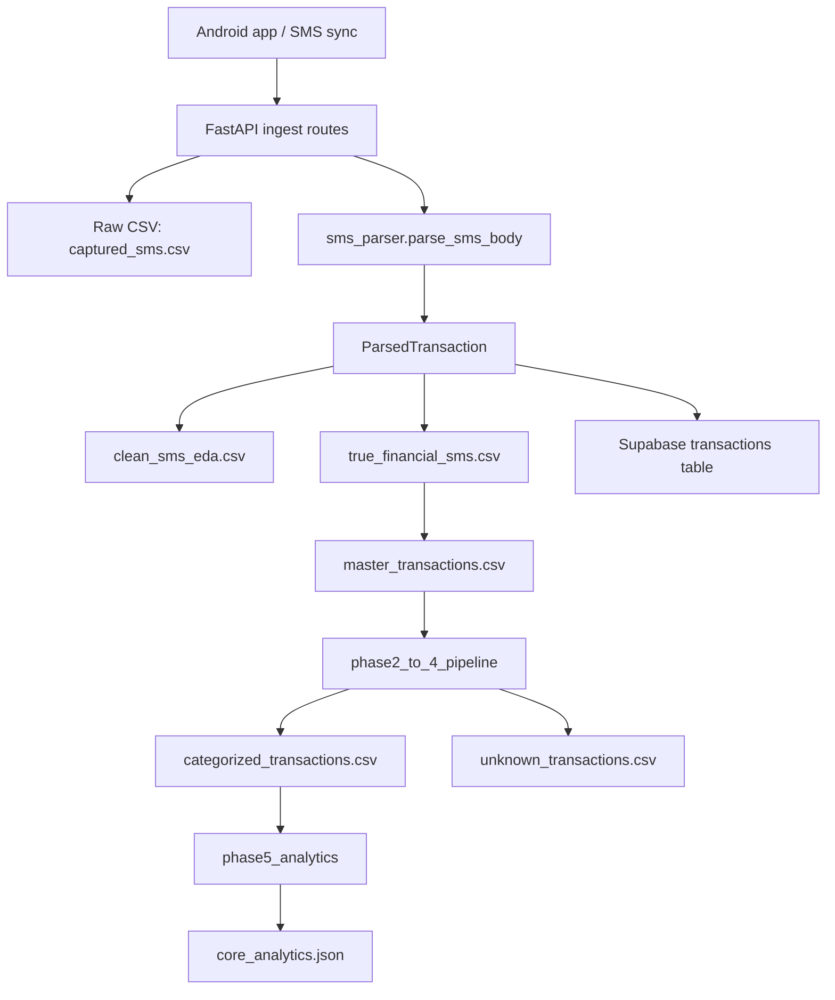

# SpendWise ML Service Pipeline Summary

This document explains the end-to-end SMS and transaction pipeline built in `ml_service`, from raw phone messages to the final analytical CSVs and JSON outputs.

The goal of the pipeline is to:

- capture SMS and notification data from the mobile app,
- filter true financial messages with regex-based rules,
- extract structured transaction fields,
- store the cleaned results in CSV and Supabase,
- merge SMS and bank-statement data into a master transaction table,
- normalize merchants and categories,
- and generate analytics for deeper research and GPT-assisted analysis.

## High-Level Flow

## What Each Module Does

### `app/main.py`

This is the FastAPI application entrypoint.

Functions and behavior:

- configures application logging,
- creates the FastAPI app with title, description, and version,
- enables permissive CORS so the Android client can call the API,
- exposes a simple health endpoint at `/`,
- registers routers for bulk loading, transactions, categorization, and SMS ingest.

### `app/sms_parser.py`

This is the core parsing engine. It contains the compiled regex rules and the logic that turns a raw SMS body into a structured `ParsedTransaction`.

Key constants and patterns:

- `SENDER_TO_BANK` maps sender IDs like `SBIUPI`, `HDFCBK`, `ICICIB`, etc. to a bank name.
- `BODY_BANK_KEYWORDS` scans the message body for bank names when the sender is not enough.
- `AMOUNT_PATTERN` extracts values written as `Rs.500`, `INR 2000`, `₹3,000.50`, or phrases like `debited by 500`.
- `BALANCE_PATTERN` extracts available balance fields.
- `ACCOUNT_PATTERN` extracts masked account or card suffixes.
- `UPI_PATTERN` extracts VPAs like `name@okhdfcbank`.
- `MODE_PATTERN` extracts transaction mode such as UPI, IMPS, NEFT, RTGS, POS, ATM, and CARD.
- `DEBIT_KEYWORDS` and `CREDIT_KEYWORDS` help infer direction.
- `FINANCIAL_KEYWORDS` acts as the main gate that decides whether a message is financial at all.
- `REF_PATTERN` extracts reference, transaction, UTR, or IMPS reference IDs.
- `RECIPIENT_DEBIT_PATTERNS` and `RECIPIENT_CREDIT_PATTERNS` extract the counterparty name.
- `SPAM_SENDER_PATTERN`, `SPAM_BODY_PATTERN`, and `FAILURE_GATE` reject ads and failed transactions.

Public helpers:

- `normalize_timestamp(timestamp_ms)` converts epoch milliseconds or ISO timestamps to UTC ISO 8601.
- `is_valid_year(timestamp_ms, target_year=2026)` checks if a timestamp belongs to the intended year.
- `sms_body_hash(body, sender=None)` produces a SHA-256 hash for deduplication.

Private extraction helpers:

- `_parse_amount(text)` converts a cleaned amount string to float.
- `_detect_bank_from_sender(sender)` maps a sender code to a bank.
- `_detect_bank_from_body(body)` scans the body for a bank name.
- `_extract_first_amount(body)` extracts the first transaction amount.
- `_extract_balance(body)` extracts available balance text.
- `_extract_account_suffix(body)` extracts the last digits of a bank account or card.
- `_extract_upi_id(body)` extracts a UPI VPA.
- `_extract_mode(body)` extracts the transaction mode.
- `_extract_ref_id(body)` extracts the transaction reference.
- `_extract_recipient(body, direction)` extracts the sender/recipient name depending on debit or credit direction.
- `_fallback_merchant_extraction(body, sender, bank)` falls back to known merchant keywords or sender-based logic.
- `_fallback_account_recipient(body, user_account_suffix)` builds an alternative recipient label when account text is all that is available.
- `_is_spam(body, sender)` filters promotional or non-financial noise.

Main parser:

- `parse_sms_body(body, sender=None)` applies the financial gate, spam filter, failure filter, amount extraction, direction detection, bank detection, UPI extraction, mode extraction, balance extraction, reference extraction, and recipient extraction.
- It returns a `ParsedTransaction` object with `is_financial=True` only when the message clearly looks like a valid financial transaction.

### `app/schemas/transaction.py`

This file defines the data contracts used throughout the service.

Models:

- `SmsPayload` is the incoming phone payload shape.
- `ParsedTransaction` is the parser output shape.
- `TransactionCreate` is used for manual or Excel-based transaction creation.
- `SupabaseTransaction` validates the row written to the database.

Important validation behavior:

- numeric fields coerce strings like `12,345.67` into floats,
- `direction` is normalized to `DEBIT` or `CREDIT`,
- `account_suffix` is reduced to the last four digits when possible,
- `dr_cr_indicator` is normalized to `DR` or `CR`.

### `app/service.py`

This module is the Supabase persistence layer and transaction query helper.

Utility functions:

- `safe_value(v)` converts `NaN`, `Inf`, `"nan"`, empty strings, and similar invalid values to `None`.
- `_direction_to_indicator(direction)` maps `DEBIT/CREDIT` to `DR/CR`.

Account and recipient helpers:

- `get_or_create_account(bank_name, account_suffix=None)` finds or creates an `accounts` row.
- `get_or_create_recipient(name, upi_id, bank)` finds or creates a `recipients` row.

Deduplication:

- `transaction_exists(account_id, amount, direction, transaction_date, ref_id=None)` checks for duplicate transactions before inserting.
- The strongest dedup key is the reference ID.
- If no reference exists, the service falls back to a same-day amount + direction check.

Persistence:

- `insert_transaction(account_id, recipient_id, row)` converts the row to the Supabase schema, normalizes the amount sign, validates mode, and inserts the record.
- `persist_sms_transaction(parsed, timestamp_iso=None, body=None, sms_id=None)` is the end-to-end persistence path for a parsed SMS.
- `create_single_transaction(row)` supports manually created transactions such as the Excel import flow.

Query helpers:

- `get_transaction_by_id(transaction_id)` fetches one transaction by ID.
- `list_transactions(limit=50, offset=0)` returns a paginated transaction list.
- `get_transaction_logic(transaction)` returns a derived explanation including direction, effective amount, and size bucket.

### `app/routes/ingest.py`

This file exposes the SMS/notification ingest API.

Core helpers:

- `save_to_csv(data_dict)` appends one record to the raw SMS CSV.
- `batch_save_to_csv(records)` appends many records at once.
- `_build_csv_record(payload, parsed)` converts a payload plus parsed result into a flat row for CSV storage.
- `_try_supabase_persist(parsed, payload)` attempts to persist a financial transaction to Supabase.

Endpoints:

- `ingest_single(payload)` handles `POST /api/data` for one SMS record.
- `ingest_bulk(payloads)` handles `POST /api/data/bulk` for batch SMS ingest.
- `list_raw(...)` handles `GET /api/data` for raw SMS lookup from Supabase.
- `get_raw(record_id)` handles `GET /api/data/{record_id}` for one raw record.

Behavioral guarantees:

- raw CSV saving happens first and is not blocked by Supabase errors,
- financial transactions are persisted only when parsing succeeds,
- bulk ingest collects per-item errors without aborting the full batch,
- sync timestamps are updated so the mobile client can resume safely.

### `app/routes/transaction.py`

This provides transaction CRUD-style access.

- `create_transaction(payload)` creates a single transaction from a structured payload.
- `get_transactions(limit=50, offset=0)` lists stored transactions.
- `get_transaction(transaction_id)` fetches one transaction.
- `get_logic(transaction_id)` returns a compact explanation of the transaction.

### `app/routes/bulk.py`

This route supports bulk import from Excel.

- `load_excel()` loads `data/SpendWise2k26.xlsx` through `load_transactions_from_excel()`.
- Each row is then inserted with `create_single_transaction()`.

### `app/routes/categorize.py`

This file is the rule-based categorization service.

Models and classes:

- `TransactionCategory` defines the category set: FOOD, TRAVEL, SHOPPING, BILLS, ENTERTAINMENT, HEALTH, EDUCATION, UTILITIES, TRANSFER, INVESTMENT, OTHERS.
- `CategorizeRequest` accepts a description, amount, transaction mode, and direction indicator.
- `CategorizeResponse` returns the predicted category, confidence, version, and reasoning.
- `CategoryRule` stores keywords, regex patterns, and confidence for one category.
- `TransactionCategorizer` loads the rules and performs the matching.

Rule logic:

- the system searches keywords first,
- then regex patterns,
- then falls back to OTHERS when no rule matches.

### `app/regex_patterns.py`

This file contains shared pattern helpers used by later pipeline phases.

- `MODE_PATTERNS` matches common transaction modes such as UPI, NEFT, IMPS, CARD, ATM, EMI, SALARY, and REFUND.
- `MERCHANT_NOISE_PATTERN` removes suffix noise like LTD, PRIVATE, SERVICES, INDIA, and similar terms.
- `CITY_NOISE_PATTERN` removes city names that often pollute merchant names.

### `app/excel_loader.py`

This utility converts the Excel workbook into transaction dicts.

- `load_transactions_from_excel(file_path)` reads the workbook.
- It maps each Excel row into a dictionary compatible with `create_single_transaction()`.
- It keeps fields like transaction reference, date, amount, debit, credit, balance, mode, bank, note, recipient name, and UPI ID.

### `app/financial_sms_processor.py`

This is the standalone CSV pipeline for the raw SMS data.

Helper:

- `_parse_financial_sms(df)` runs `parse_sms_body()` across the dataframe and writes parsed fields into columns like `parsed_amount`, `parsed_direction`, `parsed_ref_id`, `parsed_entity`, and `parsed_bank`.

Main pipeline:

- `process_all(push_to_supabase=False)` is the end-to-end CSV pipeline.
- It reads `captured_sms.csv`.
- It removes exact duplicates on `body` + `timestamp_ms`.
- It normalizes mixed timestamp formats.
- It filters invalid timestamps.
- It parses every row with the regex engine.
- It drops cross-platform duplicates using a 2-minute time bucket and the tuple `(amount, direction, time_bucket_2m)`.
- It writes `clean_sms_eda.csv`.
- It writes `true_financial_sms.csv` containing only true financial messages.
- It can optionally push financial rows to Supabase.

Supabase helper:

- `_push_to_supabase(financial_df)` re-parses each row and calls `persist_sms_transaction()`.

CLI:

- running the file directly invokes the same pipeline from the command line.

## End-to-End Processing Stages

### 1. Raw SMS capture

The mobile app sends SMS and notification records to the backend. Each record contains the raw sender, body, timestamp, device ID, and local sync metadata.

The primary raw capture file is:

- `ml_service/data/captured_sms.csv`

Current size:

- 11,812 rows

### 2. FastAPI ingest and parsing

The FastAPI ingest endpoint receives the message, parses it with `parse_sms_body()`, and immediately saves a raw CSV row.

If the message is financial, the same parsed object is also sent through `persist_sms_transaction()` to Supabase.

This means the pipeline is resilient:

- CSV storage can succeed even when Supabase is down,
- and Supabase insert failures do not stop local data capture.

### 3. Financial filtering and extraction

`parse_sms_body()` acts as the gatekeeper.

It filters out:

- promotional or ad-like messages,
- failed or reversed transactions,
- incomplete messages that do not contain an amount and direction,
- non-financial noise.

For valid financial messages, it extracts:

- amount,
- direction,
- bank,
- UPI ID,
- transaction mode,
- account suffix,
- balance after transaction,
- reference ID,
- recipient name.

The final validated financial SMS file is:

- `ml_service/data/true_financial_sms.csv`

Current size:

- 68 rows

### 4. Clean EDA CSV generation

`FinancialSmsProcessor.process_all()` writes the cleaned full SMS dataset to:

- `ml_service/data/clean_sms_eda.csv`

Current size:

- 1,682 rows

This file is useful for exploratory analysis because it preserves all cleaned messages, not just the financial subset.

### 5. Master transaction merge

The pipeline merges the bank-statement Excel rows with the parsed SMS rows into a single master table.

The legacy merge output is:

- `ml_service/data/master_transactions.csv`

Current size:

- 2,096 rows

Columns in the master table:

- `date`
- `amount`
- `debit_credit`
- `merchant`
- `category`
- `mode`
- `bank`
- `ref_id`
- `source`
- `balance`
- `notes`
- `transaction_hash`

### 6. Merchant normalization and categorization

`phase2_to_4_pipeline.py` performs the intelligence layer.

It:

- loads merchant aliases from `merchant_aliases.csv`,
- loads category rules from `category_rules.json`,
- cleans merchant names by removing corporate and city noise,
- detects transaction mode using shared regex patterns,
- maps transactions to higher-level categories,
- assigns a confidence score,
- exports the full categorized dataset,
- exports all unresolved rows for manual review.

Final outputs:

- `ml_service/data/categorized_transactions.csv`
- `ml_service/data/unknown_transactions.csv`

Current sizes:

- `categorized_transactions.csv`: 2,096 rows
- `unknown_transactions.csv`: 1,897 rows

### 7. Analytics generation

`phase5_analytics.py` turns the categorized dataset into a compact analytics JSON file.

It computes:

- monthly income vs expense,
- monthly spend,
- category spend,
- top merchants,
- recurring transaction candidates.

Final analytics artifact:

- `ml_service/data/core_analytics.json`

Current content summary:

- 38 months in `income_vs_expense`
- 6 categories in `category_spend`
- 20 top merchants captured in `top_merchants`
- 45 recurring transaction candidates

## Final Data Artifacts

| File | Purpose | Rows |
| --- | --- | ---: |
| `captured_sms.csv` | Raw SMS and notification capture | 11,812 |
| `clean_sms_eda.csv` | Cleaned SMS dataset for analysis | 1,682 |
| `true_financial_sms.csv` | Strictly financial SMS rows | 68 |
| `master_transactions.csv` | Merged SMS + bank master table | 2,096 |
| `categorized_transactions.csv` | Categorized final transaction dataset | 2,096 |
| `unknown_transactions.csv` | Rows that still need manual labeling | 1,897 |
| `core_analytics.json` | Summary analytics for dashboards and deep research | N/A |

## How Deduplication Works

The pipeline deduplicates at multiple levels:

1. Exact duplicate raw SMS rows are removed by body and timestamp.
2. The parser and financial processor eliminate cross-platform duplicates by grouping on amount, direction, and a 2-minute time bucket.
3. Supabase persistence adds a database-level duplicate check using transaction reference or the amount + direction + date window.
4. Legacy master-table merging deduplicates by transaction ID and then by amount + direction + day + merchant.

This layered approach makes the final transaction set much safer for analysis than a single-pass deduplication rule.

## Why The Regex Pipeline Matters

The regex layer is the main reason the service works on messy bank SMS data.

It lets the pipeline:

- detect the actual transaction amount even when the SMS wording varies,
- distinguish debit from credit using multiple textual signals,
- infer bank names from sender codes and body text,
- extract the transaction counterparty,
- recover reference IDs for deduplication,
- reject spam and failed transactions before they enter the final dataset.

That makes the final CSVs suitable for downstream GPT analysis, merchant clustering, anomaly detection, recurring-spend analysis, and category modeling.

## Practical GPT Use Cases

This pipeline is already prepared for deeper analysis in GPT or another LLM.

Useful questions now include:

- Which merchants explain the biggest spikes in monthly expenses?
- Which transactions are internal transfers versus external spend?
- What recurring patterns show up in the analytics JSON?
- Which merchants need alias normalization?
- Are there suspicious one-off large transfers or salary-like inflows that should be separated from normal spending?

## Recommended Next Step

Use `categorized_transactions.csv` as the primary analysis table and `core_analytics.json` as the summary layer for GPT prompts. If you want an even more compact handoff file, generate a prompt-style markdown that contains only:

- the schema,
- the final counts,
- the key monthly spikes,
- the top merchants,
- and the unresolved unknowns.
